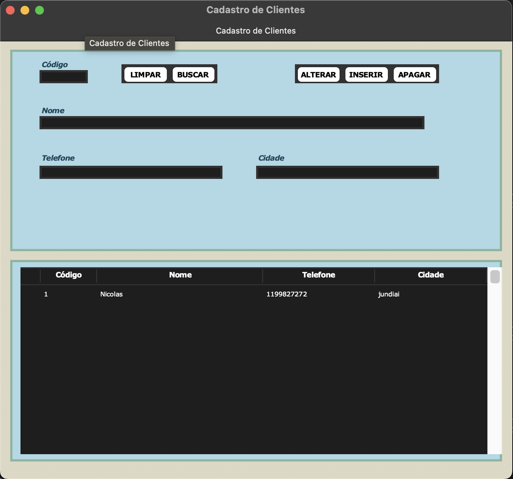

# Sistema de Cadastro de Clientes

## Visão Geral

Este projeto é um **Sistema de Cadastro de Clientes** desenvolvido em Python utilizando Tkinter. Ele permite que os usuários registrem, busquem, atualizem e excluam informações de clientes em uma interface interativa com um design visual moderno e futurista.

## Funcionalidades

- **Adicionar Novos Clientes**: Adicione facilmente informações de novos clientes, incluindo nome, telefone e cidade.
- **Buscar Clientes**: Pesquise clientes pelo código único de cada um.
- **Atualizar Informações**: Atualize as informações de clientes existentes diretamente pela interface.
- **Excluir Clientes**: Remova cadastros de clientes do sistema.
- **Design**: Interface visualmente atraente com cores neon e layout minimalista.
- **Visualização Dinâmica de Tabela**: Veja todos os clientes em uma tabela dinâmica com atualizações em tempo real.
  
## Design

- **Esquema de Cores**: A interface usa cores neon verdes e azuis sobre um fundo preto, proporcionando uma sensação moderna e futurista.
- **Fontes Modernas**: Fontes em negrito, limpas e em itálico para uma experiência de usuário estilosa.
- **Layout Responsivo**: Botões e campos de entrada são organizados de forma intuitiva, com espaçamento adequado para facilitar o uso.

## Tecnologias Utilizadas

- **Python**: Linguagem principal utilizada no desenvolvimento.
- **Tkinter**: Biblioteca para construção da interface gráfica (GUI).
- **ttk (Widgets Tematizados do Tkinter)**: Utilizado para estilizar a tabela `Treeview`.

## Como Executar

1. Certifique-se de ter o Python instalado em sua máquina.
2. Instale as bibliotecas necessárias (se necessário).
3. Execute o arquivo principal para abrir o sistema de cadastro futurista.
